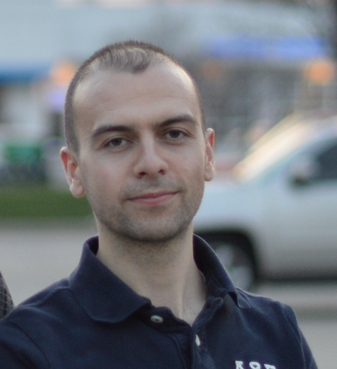

---

layout: home
site: https://adaskin.github.io
---

## Contact
    Ammar Daşkın 
    Istanbul, Turkey
    email: adaskin25@gmail.com 
  

[Resume (pdf)](cv.pdf)  
## Profiles:
[google scholar](https://scholar.google.com/citations?user=5tbs4i8AAAAJ) 
[web of science profile](https://www.webofscience.com/wos/author/record/151038)  
[orchid](https://orcid.org/0000-0002-1497-5031)  
[github](https://github.com/adaskin)  
[site](https://adaskin.github.io)  
# Summary
As a researcher in quantum computation, algorithms, and machine learning and their applications in data science, bioinformatics and chemistry, I have worked on various topics like finding numerical methods and matrix algorithms for optimally mapping computations to quantum circuits, designing quantum algorithms for matrix computations and optimization, designing algorithms for processing high dimensional data on quantum computers and testing and optimizing quantum machine learning models for near term and fault tolerant quantum computers and their practical applications to data science problems.

I have also taught undergraduate and graduate courses in Algorithm Design, Data Structures, Operating Systems, Systems Programming (in Linux) and Quantum Computing. In addition, supervise B.Sc. student projects.
