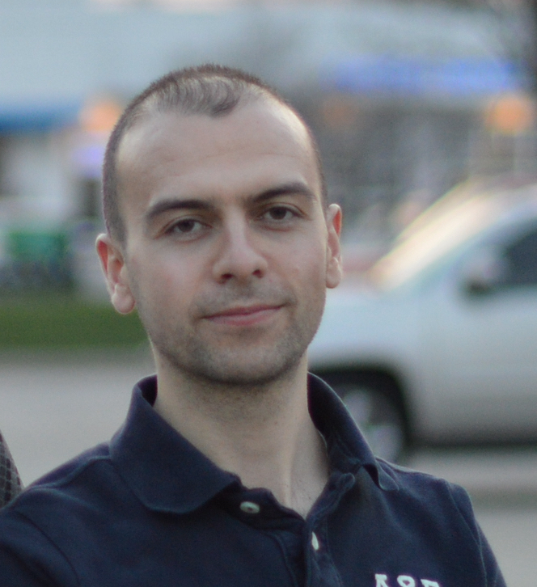

---
# Feel free to add content and custom Front Matter to this file.
# To modify the layout, see https://jekyllrb.com/docs/themes/#overriding-theme-defaults

layout: home
---

## Contact
    Ammar Daşkın 
    Istanbul, Turkey
    email: adaskin25@gmail.com 
    
[Resume (pdf)](cv.pdf)  
## Profiles:
[google scholar](https://scholar.google.com/citations?user=5tbs4i8AAAAJ)  
[web of science profile](https://www.webofscience.com/wos/author/record/151038) 
[orchid](https://orcid.org/0000-0002-1497-5031) 
[github](https://github.com/adaskin)  

# Summary
I am a researcher in the field of quantum computation, information and algorithms, as well as their applications in data science, bioinformatics and chemistry.  I have worked on various topics like finding numerical methods and matrix algorithms for optimally mapping computations to quantum circuits, designing quantum algorithms for matrix computations and optimization, designing algorithms for processing high dimensional data on quantum computers and testing and optimizing quantum machine learning models for near term quantum computers and their applications to data science problems.

[List of publications on Google Scholar](https://scholar.google.com/citations?user=5tbs4i8AAAAJ&hl=en)

# Teaching summary
I have taught a variety of computer science courses, including data mining (in Python), system programming (in Unix), operating systems (Linux kernel), data structures, algorithm analysis, and compilers at the Computer Engineering Department of Istanbul Medeniyet University. 
## Lecture Notes 
[System Programming Lecture Notes](https://sites.google.com/view/adaskin/teaching/system-programming) 
[C Programming Lecture Notes](https://sites.google.com/view/adaskin/teaching/c-programming-lecture-notes) 
[Python Programming Lecture Notes](https://sites.google.com/view/adaskin/teaching/python-lecture-notes) 
[Data Structures and Algorithms Lecture Notes](https://sites.google.com/view/adaskin/teaching/data-structures-and-algorithms) 
[Operating Systems](https://sites.google.com/view/adaskin/teaching/operating-systems)  
[Data mining](https://sites.google.com/view/adaskin/teaching/data-mining)  
[Compiler Design](https://sites.google.com/view/adaskin/teaching/compilers)  